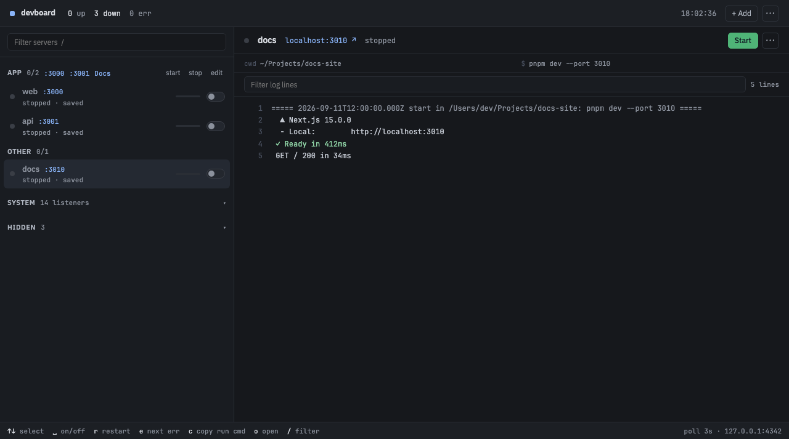

# devboard

See every dev server on your Mac, including the ones you forgot, and take them over.

A Bun server on `127.0.0.1:4242`, a vanilla JS page, a `devboard` CLI, and an optional Swift menu bar extra. It discovers listeners with `lsof` and `ps`, collapses each wrapper chain into one row, and can kill, start, restart, pin, group, and tail logs.

## Requirements

- macOS 14+
- Bun 1.2+
- `lsof`, `ps`, `git`, and `du` on PATH
- Xcode 16 or a Swift 6 toolchain only if you want the menu bar extra

## Quickstart

    bun install
    DEVBOARD_TRAY=0 bun run start
    # open http://127.0.0.1:4242

Start the board from your login shell so fnm/bun PATH is inherited by anything you launch from the page.

`devboard install` (optional) puts a `devboard` symlink in `~/.local/bin` and builds the menu bar app when Swift is present. Without installing, `bun run devboard -- <cmd>` is the same CLI. The tray is skipped when `swift` is missing; `bun run tray:build` builds it later.

    bun test
    bun run dev            # restarts on file change

After install, any terminal:

    devboard               # list what's on
    devboard start api-3003
    devboard logs web -f
    devboard stop-all
    devboard up            # start the board if it is off
    devboard tray          # show the menu bar extra

## Environment

| Variable | Default | What it does |
|---|---|---|
| `PORT` | `4242` | Port the board binds on `127.0.0.1` |
| `DEVBOARD_URL` | `http://127.0.0.1:4242` | Board the CLI talks to |
| `DEVBOARD_HOME` | `~/.devboard` | Pinned list, projects, presets, ignored ids, and logs |
| `DEVBOARD_TRAY` | unset (on) | Set `0` to start the server without the menu bar extra |

`~/.devboard` holds `services.json`, `projects.json`, `presets.json`, `ignored.json`, and `logs/<id>.log`. Files are re-read on every request, so hand edits work without a restart.

## Why

pm2 and Overmind supervise processes you handed them. Port-killer menu apps list listeners and can SIGKILL one. They do not collapse a `pnpm` → `next` → `next-server` chain into one row, pin a server you started from a terminal so you can stop and start it later, group a stack by project, or tail the log of something the board launched. That is the product.

## What it does

- **Discover.** `lsof` for listeners, `ps` for the process table. Each listener is walked up its parents while they are dev wrappers (node, bun, deno, npm, npx, pnpm, yarn, next, next-server, `sh -c`). The top wrapper is the root and one row. The walk never climbs into devboard itself, so services it started keep their own row.
- **Kill.** SIGTERM to every pid in the tree at once, SIGKILL to survivors after 3 seconds.
- **Pin.** Saves name, folder, command and port so the service can be started later. Matched to running rows by folder plus port. Switching an unsaved server off pins it first.
- **Start / Restart.** Runs the saved command in its folder via `/bin/sh -c`, detached, output appended to `~/.devboard/logs/<id>.log`. Closing the board does not stop what it started. Optional restart-on-crash (5 tries, exponential backoff) relaunches a stopped server whose last log looks like an error. Stop and Kill disarm it.
- **Logs.** Last 4000 lines, refreshed every 2 seconds. Filter, jump between errors, follow the tail. Files exist only for services the board started. Each file is capped at 5 MB at start (last 2 MB kept).
- **CLI.** `start`, `stop`, `restart`, `logs [-f]`, `start-all`, `stop-all`, `up`, `tray`. `stop-all` pins unsaved running rows first, like the page.
- **Menu bar.** Count of servers on, start/stop, open a port, open the board. Quitting the extra does not stop your servers.
- **Projects, worktrees, presets, attention, env.** Group servers, inventory git checkouts, resume a named set, surface port conflicts and crashed pins, edit env overrides.

The page layout, keys, and tokens live in `design.md`.

## Limits

- Logs exist only for services devboard started. A process you launched from a terminal keeps its output in that terminal; macOS gives no way to attach.
- Killing a **System** row (Postgres, Redis, ControlCenter) usually just makes launchd or Homebrew restart it. Use `brew services stop <name>`.
- If a pinned service comes up on a different port than the one saved, it shows as stopped next to a new unpinned running row. Matching is cwd + port.
- Log files rotate at 5 MB (last 2 MB kept) when a service starts. Deleting one is still safe.
- Health probes run only when you set a health URL. A server that logs every request to `/` will not see board traffic unless you ask for it.

## Security

Loopback only. The API kills process trees and runs saved shell commands. Never bind off `127.0.0.1`. There is no remote or multi-machine mode, and no auth — one user, one machine.

Requests whose Host or Origin is not loopback (`127.0.0.1`, `localhost`, `::1`), or whose `Sec-Fetch-Site` is present and not `same-origin` or `none`, get 403. Non-GET requests must be `application/json` (415 otherwise). There are no CORS headers.

## Known issues

- A server that takes a while to bind shows as stopped until a listener appears. `POST /api/start` can double-start during that window.
- The 5 MB log cap is enforced at start, not while a chatty server is running.

## Smoke

`bash scripts/smoke.sh` drives the eight-step checklist against a throwaway `DEVBOARD_HOME`. It aborts if `:4242` or `:3999` is already taken. Last local run before this rewrite: 2026-09-10, passed.

## For agents and contributors

`AGENTS.md` is the instruction file for any coding agent. `CONTRIBUTING.md` is for humans. `agents/` holds scoped rules and role prompts. `design.md` is the UI spec.

## License

devboard is MIT. See `LICENSE`. The only npm dependency is `@types/bun` (dev-only, MIT).

The UI fonts under `public/fonts/` are SIL Open Font License 1.1: IBM Plex Sans
(Copyright © 2017 IBM Corp.) and JetBrains Mono (Copyright 2020 The JetBrains
Mono Project Authors). License texts are `public/fonts/OFL-IBM-Plex.txt` and
`public/fonts/OFL-JetBrains-Mono.txt`.
